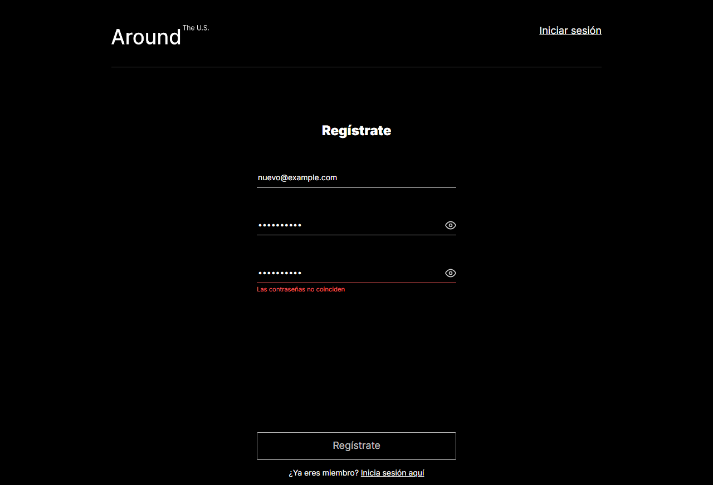
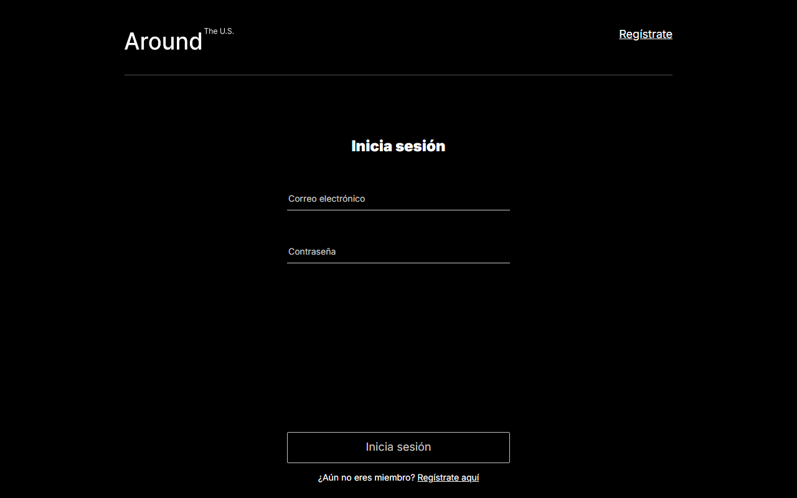
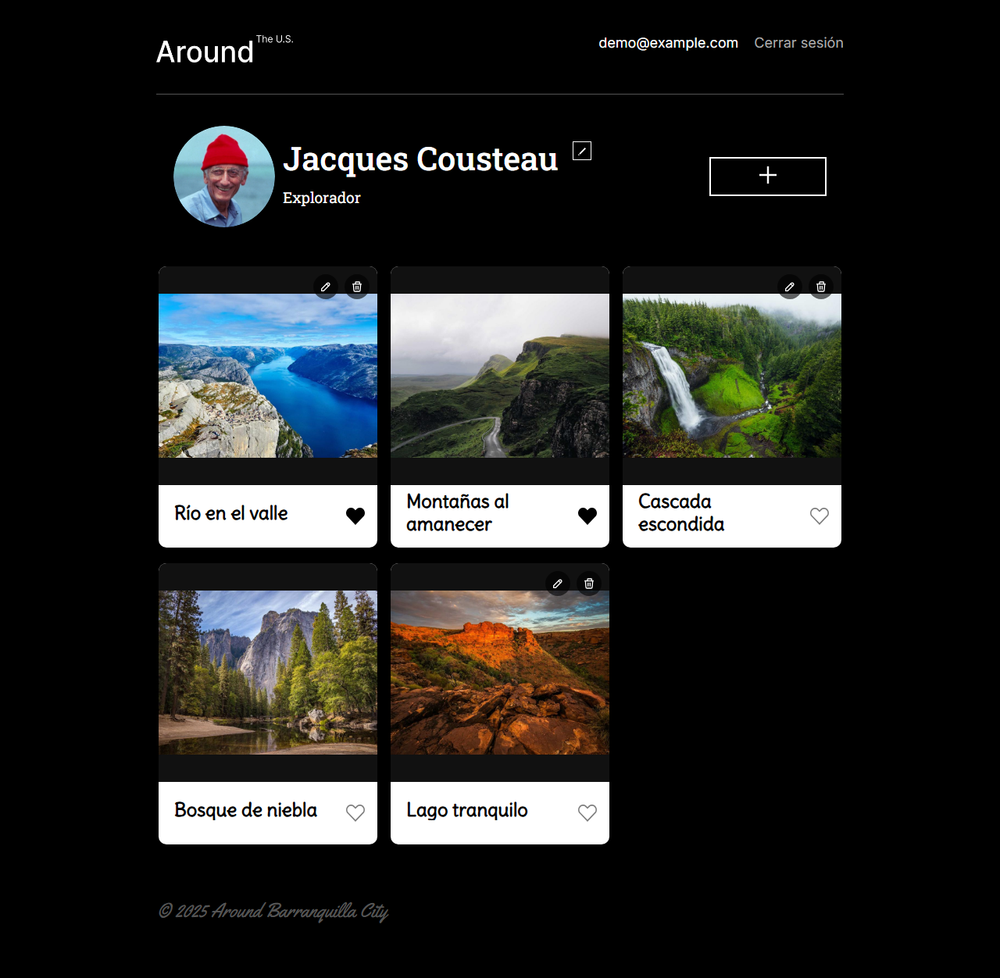
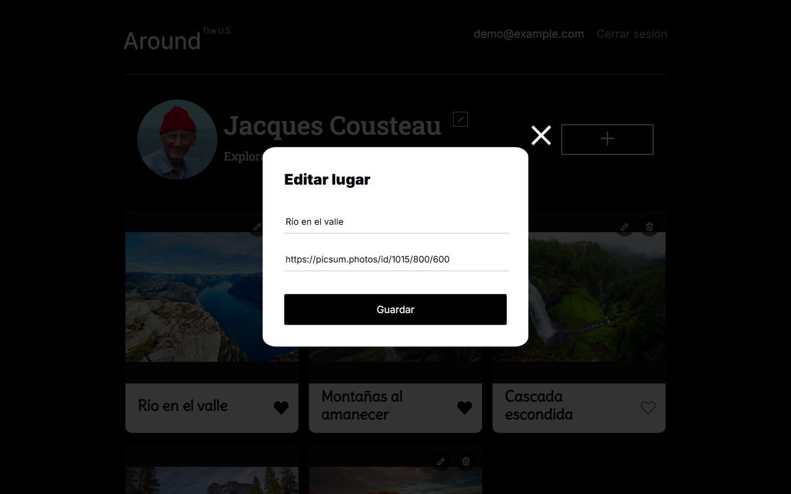
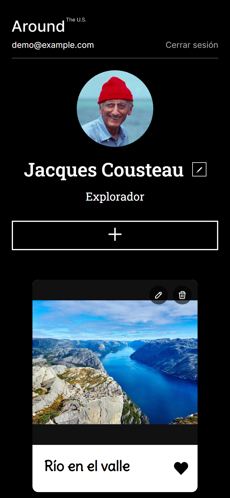

# Around the U.S. — Full Stack

Aplicación web completa para compartir lugares con fotos: un cliente en **React** y una API REST en **Node.js/Express** con **MongoDB**, con registro e inicio de sesión mediante **JWT**, desplegada en un servidor propio en Google Cloud con HTTPS.

## 🌐 URL de la aplicación

| | URL |
|---|---|
| **Aplicación (frontend)** | https://devama.duckdns.org |
| **API (backend)** | https://api-devama.duckdns.org |

> Se puede acceder por HTTP y por HTTPS; HTTP redirige automáticamente a HTTPS.

## 📸 Capturas de pantalla

| Registro | Inicio de sesión |
|---|---|
|  |  |



| Editar una tarjeta | Editar el perfil |
|---|---|
|  |  |


**Versión móvil**



## ✨ Funcionalidad

**Cuentas de usuario**
- Registro con correo, contraseña y confirmación de contraseña (deben coincidir).
- Inicio de sesión que devuelve un JWT válido por 7 días. La sesión se conserva en `localStorage` y se valida al abrir la aplicación.
- Rutas protegidas: sin sesión, el usuario es redirigido a `/signin`.
- Cierre de sesión con confirmación.

**Perfil**
- Cada usuario nuevo recibe valores por defecto (nombre, descripción y avatar).
- Edición de nombre (hasta 40 caracteres), descripción (hasta 100) y foto de perfil.

**Tarjetas de lugares**
- La galería es compartida: todos los usuarios ven todas las tarjetas.
- Cualquier usuario puede dar y quitar "me gusta"; el estado es por usuario.
- Crear, **editar** (título y enlace de la imagen) y eliminar tarjetas, **solo las propias**. El servidor lo hace cumplir con un 403 aunque se intente saltar la interfaz.
- Las imágenes conservan su proporción original dentro del recuadro, sin recortarse ni deformarse.
- Ampliación de la imagen en un popup.

**Diseño adaptable**
- Se adapta a móviles, tabletas y escritorio; se probó desde 320 px de ancho, incluidas las pantallas de acceso y los popups.

**Manejo de errores**
- Los mensajes del servidor llegan hasta la pantalla: en el propio formulario, con el popup abierto y lo escrito intacto, o en un aviso general si el formulario ya se cerró.
- Si no hay conexión con el servidor se muestra un mensaje claro.

## 🛠️ Tecnologías y técnicas

**Frontend** (`frontend/`)
- React 19, Vite 7 y React Router 7.
- Context API para el usuario actual y las acciones compartidas.
- Formularios con validación en tiempo real (`useValidatedInput`) y envío con estado de carga y errores (`useFormSubmit`).
- Pruebas con Vitest y Testing Library.
- ESLint.

**Backend** (`backend/`)
- Node.js, Express 5 y Mongoose (MongoDB).
- Autenticación con `jsonwebtoken` y contraseñas cifradas con `bcryptjs`; el hash nunca se devuelve (`select: false`).
- Validación de solicitudes con `celebrate`/Joi y `validator` (correos y URL).
- Middleware de autorización, manejo de errores centralizado en un único middleware y errores propios por código de estado.
- Registro de solicitudes (`request.log`) y de errores (`error.log`) en JSON con `winston` y `express-winston`, sin cabeceras sensibles.
- CORS con `cors` y variables de entorno con `dotenv`.
- ESLint con la guía Airbnb.

**Infraestructura**
- Servidor en Google Cloud (Compute Engine, Ubuntu).
- nginx como proxy inverso y servidor de archivos estáticos.
- Certificados HTTPS de Let's Encrypt (Certbot) con renovación automática.
- Dominio y subdominio gratuitos con DuckDNS.
- pm2 para mantener la API en ejecución y reiniciarla si se cae.

## 📁 Estructura del repositorio

```
.
├── backend/      API REST (Node.js + Express + MongoDB)
├── frontend/     Cliente (React + Vite)
├── screenshots/  Imágenes de este README
└── README.md
```

## 🔌 API

Todas las rutas, salvo `/signin` y `/signup`, requieren la cabecera `Authorization: Bearer <token>`.

| Método | Ruta | Descripción |
|---|---|---|
| `POST` | `/signup` | Crea un usuario (`email`, `password`; opcionales `name`, `about`, `avatar`) |
| `POST` | `/signin` | Devuelve `{ token }` si las credenciales son correctas |
| `GET` | `/users` | Lista los usuarios |
| `GET` | `/users/me` | Datos del usuario autenticado |
| `GET` | `/users/:userId` | Datos de un usuario |
| `PATCH` | `/users/me` | Actualiza `name` y `about` |
| `PATCH` | `/users/me/avatar` | Actualiza `avatar` |
| `GET` | `/cards` | Lista todas las tarjetas |
| `POST` | `/cards` | Crea una tarjeta (`name`, `link`) |
| `PATCH` | `/cards/:cardId` | Edita `name` y `link` de una tarjeta propia |
| `DELETE` | `/cards/:cardId` | Elimina una tarjeta propia |
| `PUT` | `/cards/:cardId/likes` | Da "me gusta" |
| `DELETE` | `/cards/:cardId/likes` | Quita el "me gusta" |

Las respuestas de error contienen solo el campo `message`:

| Código | Cuándo |
|---|---|
| `400` | Datos inválidos (falla la validación) |
| `401` | Credenciales incorrectas, o token ausente o inválido |
| `403` | Intento de editar o eliminar la tarjeta de otro usuario |
| `404` | El recurso o la ruta no existe |
| `409` | El correo electrónico ya está registrado |
| `500` | Error del servidor: "Ha ocurrido un error en el servidor" |

## 💻 Ejecución en local

Requisitos: Node.js 20.19 o superior y MongoDB en `localhost:27017`.

```bash
# Backend (http://localhost:3000)
cd backend
npm install
npm run dev

# Frontend (http://localhost:5173), en otra terminal
cd frontend
npm install
npm run dev
```

Otros comandos: `npm run lint` en ambos proyectos y `npm test` en `frontend/`.

### Variables de entorno

| Variable | Dónde | Descripción |
|---|---|---|
| `NODE_ENV` | backend | En `production` es obligatorio definir `JWT_SECRET` |
| `JWT_SECRET` | backend | Clave para firmar y verificar los JWT. En desarrollo se usa una clave de prueba y no hace falta ningún `.env` |
| `PORT` | backend | Puerto de la API (por defecto `3000`) |
| `MONGO_URL` | backend | Conexión a MongoDB (por defecto `mongodb://localhost:27017/aroundb`) |
| `VITE_API_URL` | frontend | URL de la API (por defecto `http://localhost:3000`; en producción `frontend/.env.production`) |

## 🚀 Despliegue

1. **Backend:** el repositorio se clona en el servidor, se instalan las dependencias y se crea un `.env` con `NODE_ENV=production` y un `JWT_SECRET` aleatorio (el archivo solo existe en el servidor). pm2 mantiene el proceso activo.
2. **Frontend:** se compila con `npm run build` y el contenido de `dist/` se copia al servidor, donde nginx lo sirve.
3. **nginx:** un bloque para `devama.duckdns.org` que sirve el frontend y otro para `api-devama.duckdns.org` que reenvía a la API en el puerto 3000.
4. **HTTPS:** certificados de Let's Encrypt emitidos con Certbot.

## 👤 Autor

**Anthony Martinez** — [@devanthony92](https://github.com/devanthony92)
